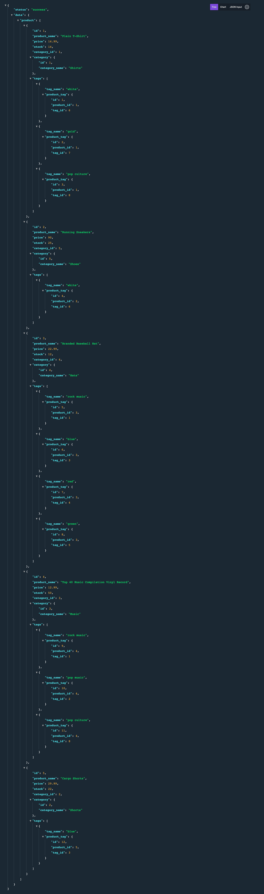

# E-commerce Back End

## Description

A back end for an e-commerce site created using Express.js and Sequelize to interact with a MySQL database.

There are Categories (_i.e Hats_), Products (_i.e Branded Baseball Hat_) for each category , and Tags (_i.e Blue_) for each product

You can perform all CRUD operations on each of the tables that hold the data and you will see the associated data

So if you select the product _Branded Baseball Hat_, you will see its related information such as the price but also the category it's in and its tags, same if you pick from category or tag

## Screenshot and Video

Here is a visual demonstration of the application at work

[part1](https://watch.screencastify.com/v/kAoJ116ddZQ4Ce4uyxJF)
[part2](https://watch.screencastify.com/v/72xKJLCDOMy9D5AUOu3s)



## Table of Contents

- [Usage](#usage)
- [Liscence](#liscence)
- [Contributions](#contributions)
- [Questions](#questions)

## Usage

To start with, you will require Node.js, if you don't have it you can install it [here](https://nodejs.org/en/download/)

You will also download MySQL, downloading it will require more than 1 step so you will need to look that up

To start with, once you've opened up the project files in your code editor, open up your command line go to the root directory of the project and type `npm install` which will install all of the dependencies for you

Next, if you go to `/config/connection.js` and look for a bit you will find `process.env.DB_NAME, process.env.DB_USER, process.env.DB_PW`, these are your credentials, you can replace them with the database name ("ecommerce_db"), your username and password. Make sure you have quotations around them. Alternatively you can create a `.env` file in the root directory and just write

```
DB_NAME='ecommerce_db'
DB_USER='myUsername'
DB_PW='myPassword'
```

The next step is within the command line type `source db/schema.sql` which will run the code in that file and create the database for you, if it doesn't work, double check to make sure you're in the right directory

Afterwards, in the command line type `npm run start` which will start the server or `npm run watch` which will use nodemon to start your server

In your command line it should show you a bunch of statements which is sequelize creating the tables for you

Now, if you want to insert some data thats already been created you can type `npm run seed` in the command line and it will seed the data for you

You can actually begin using it at this point, though you will need something like Insomnia or Postman to be able to create, update or delete data otherwise you can go to your browser and type `localhost:3001/api/categories` (You can also replace categories with products or tags to view one of the others) and it will show you all of the seeded categories and their associated data (In JSON)

If you know how to use Postman then type in the same URL.

If you want to get a single category then type `localhost:3001/api/categories/<some-number>` some-number is the id, check the id numbers when you view all of the categories

If you want to create a category then the url should be `localhost:3001/api/categories` (since the id will be automatically generated) and you will need to POST the data in JSON format, it should look like

```
{
	"category_name": "New Category"
}
```

If you want to Update the data then go to `localhost:3001/api/categories/id` where the id is the id number of the category you want to update then the same as above, except change "New Category" to the updated name you want, make sure that this is a PUT request this time

And lastly for deleting, go to the same url, `localhost:3001/api/categories/id` and input the id of the category you wish to delete and make sure this is a DELETE requets

This works the same for both products and tags, you can see what fields can be updated and what need to be inserted by viewing the seeded data

If you want to get rid of all of the data or you make changes to the Models(tables) and want those changes to actually show then stop the server by going to the command line and pressing `ctrl+C` then go to the `server.js` file and change the line of code `equelize.sync({ force: false })` to `equelize.sync({ force: true })` and restart your server, this will automatically reset the tables so you will lose all of the data in the tables and any changes you made to the Models in the code will now be shown. If you don't want to lose all of your data each time you restart the server then change `force: true` back to false.

(_If you're using npm run watch then nodemon will automatically restart your server when ever there are changes in the server.js file so you don't need to manually do it_)

## Liscence

Not under any liscence

## Contributions

Made by Daniel Arzanipour

## Questions

[My Github](https://github.com/DanielArzani)

If you need to reach me for any additional questions, you can reach me at my [Gmail](mailto:daniel.arzanipour@gmail.com)
